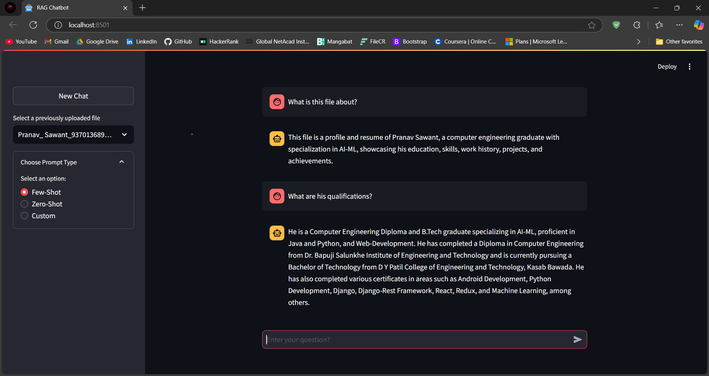

# RAG Chatbot using Streamlit and Azure OpenAI

This project is a Retrieval-Augmented Generation (RAG) chatbot implementation using Streamlit, Azure OpenAI API, and Azure OpenAI Embeddings. The application efficiently retrieves relevant information from user-uploaded documents, provides responses based on contextual understanding, and reduces processing costs by reusing embeddings and vector databases for previously uploaded files.

## Key Features

- **Choose Between Uploaded Files**: Users can select from a list of previously uploaded files, which enables quick switching between documents for context-specific querying.
- **Cost-Effective Embedding Management**: If a file has been uploaded previously, the app reuses the associated embeddings and vector database, avoiding redundant processing and reducing costs.
- **Custom Prompt Options**: Offers customizable prompt types (Few-Shot, Zero-Shot, and Custom), enhancing control over how questions are answered.

## Project Structure and Components

- **Streamlit for UI**: Provides an intuitive, interactive chat interface where users can upload files, select prompts, and engage in conversations.
- **Azure OpenAI API**: Used for language model processing, with fine-tuned responses based on document content.
- **FAISS Vector Store**: Stores embeddings and supports fast retrieval for scalable and efficient document querying.
  
## Screenshots


*Sample chatbot conversation.*

.png)
*Custom prompt options for enhanced control over responses.*


*Dialog for uploading a new PDF file.*


*Dropdown menu for selecting previously uploaded files.*

## Code Highlights

The core functionalities of the project include:
- **Document Loading**: Extracts text from uploaded PDFs using `PyPDFLoader`.
- **Document Embedding and Vector Store Creation**: Embeds document content and creates a FAISS vector store, with support for reusing embeddings.
- **Conversation Chain**: Generates contextual responses with `AzureChatOpenAI` based on selected prompts and document context.

### Sample Code

The following code snippet shows some key elements:

```python
from langchain_community.docstore.in_memory import InMemoryDocstore
from langchain.text_splitter import RecursiveCharacterTextSplitter
from streamlit.runtime.uploaded_file_manager import UploadedFile
from langchain_community.document_loaders import PyPDFLoader
from langchain_openai import AzureOpenAIEmbeddings
from langchain_community.vectorstores import FAISS
from langchain_core.prompts import PromptTemplate
from langchain.chat_models import AzureChatOpenAI
# Additional imports and application logic as shown in the code...
